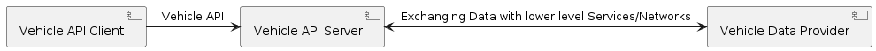
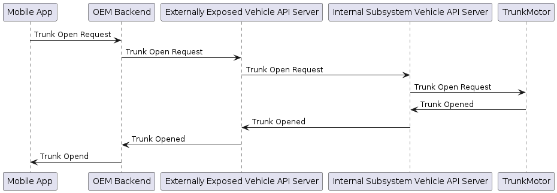
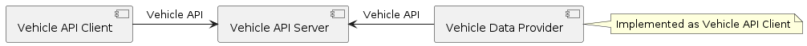
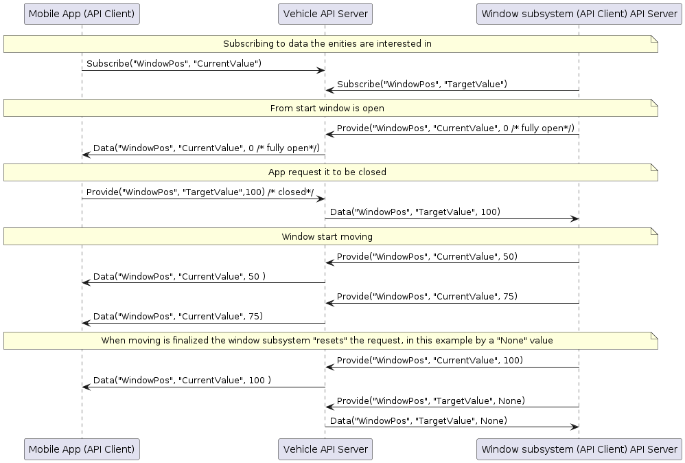

# Introduction to Vehicle APIs and VSS Vehicle APIs 

## Introduction

The term "Vehicle API" is commonly used, but most of the time without actually referring to what it actually means.
This document intends to describe the COVESA definition a of VehicleAPI as well as COVESA recommendations on
how a Vehicle API can be implemented.

## What is a Vehicle API

COVESA defines a Vehicle API as an interface that allows to exchange data and use services related to a vehicle.
The logical architecture is shown in the image below.



The Vehicle API Client is someone interested in exchanging data or using services related to a vehicle.
The Vehicle API Server is someone offering a Vehicle API.
The data and services offered by the Vehicle API Server might exist locally within the Vehicle API Server,
but it may as well exist somewhere else. In that case it is assumed that the Vehicle API Server can exchange
data or use services in other entities, called Data Providers in the image above.
The interface between Vehicle API Server and Data Providers may, but does not need to, be realized by a Vehicle API.

Access to the services offered by a VehicleAPI is typically restricted. A Vehicle API Server typically implements
mechanisms to control access.
A Vehicle API server may also in some cases restrict access based on environmental conditions, for instance reduce
the set of services available if only low-bandwidth connectivity exists, or disable certain services due to safety reasons.

With this definition existing protocols like OBD-II can be considered as VehicleAPIs.
[Android VHAL](https://android.googlesource.com/platform/hardware/interfaces/+/master/automotive/vehicle/2.0/types.hal)
can also be considered as a Vehicle API, although intended for a specific scenario.

### Use-case scenarios

A Vehicle API may be used to offer "external access" to a vehicle, but it does not necessarily need to be used for that
purpose. Below is a list of example use-case scenarios:

* An app in a mobile phone wants to exchange data directly with a vehicle
* An app in a mobile phone connects to an OEM Vehicle API Server to exchange data related to a vehicle
* OEM backends use a Vehicle API to exchange data with vehicles
* An in-vehicle app (in e.g. infotainment) use a Vehicle API to get access to vehicle data
* A subsystem inside the vehicle uses a Vehicle API to exchange data with other subsystems
* Programmatic API inside a subsystem

Vehicle APIs may exist in several layers, using different technologies and different security concepts.
A hypothetical example is shown below showing how an App in a mobile phone could request the trunk to be opened.



In this example all communication except possibly the last step towards the motor may be performed using a Vehicle API.
This means that there might be several Vehicle API Servers involved, in this example possibly one in the OEM cloud and
two within the vehicle. Protocols, services offered and security concept will likely vary.
The OEM backend server may for instance verify that the mobile phone actually belongs to the vehicle owner.
The Vehicle API servers inside the vehicle are likely unaware of who owns the vehicle, but may check that the request
to open the trunk actually comes from the OEM and is intended for this particular vehicle.

It is not necessarily so that the client always is "upstream".
If the "downstream" component knows what information that is requested by the upstream component or what service to
request in the upstream component, then the "downstream" component may act as client.
In some deployments both the upstream and downstream component may interact with the same Vehicle ASPI Server like
in the example below.



## What is a VSS Vehicle API

A VSS Vehicle API is a Vehicle API focusing on exchange of [VSS](https://github.com/COVESA/vehicle_signal_specification)
data. VSS specified three types of signals:

* Attributes - Data that typically change at most once per ignition cycle. Typically only readable for an App.
* Sensors - Data that change more frequently. Typically only readable for an App.
* Actuators - Represents data that can be used to control the vehicle. Typically both readable and writable for an App.

For actuators the VSS semantic is that a "read" by default gets the current value of that property, while a "write"
sets the wanted value. The reason for this distinction is that the App, for example an App in a mobile phone,
cannot instantly actuate a request. If the vehicle user remotely wants to open the hood of the vehicle a request to
open the hood can be sent to the vehicle. Using VSS semantics this is performed by sending a request to change
`Vehicle.Body.Hood.IsOpen` to `True`. Reading `Vehicle.Body.Hood.IsOpen` just after the request has been sent
will return `False`. First when it has been checked that the user has the rights to open the hood and that it is
safe to open the hood will be opened and then reading the `Vehicle.Body.Hood.IsOpen` signal will return `True`.

To be called a VSS Vehicle API the Vehicle API must base the syntax, transport payload or the programmatic interface
on the names of signals defined in the VSS catalog. If the programmer knows the VSS catalog and reads the API description,
it shall be easy to know how to make a call to get a specific VSS signal. How this is done is up to the API.
It can be done by referencing to VSS signals my full path based on parent VSS branches like `/Vehicle/Speed` or
`Vehicle.Speed`, but it may also be provided programmatically by exploring a VSS-like object tree like in this example:

```
Vehicle my_vehicle = get_my_vehicle(owner_id)
my_vehicle.get_speed()
```

It is in general expected from VSS that a VSS Vehicle API supports at least the following services:

* Reading current value of an attribute, sensor or actuator
* Writing the wanted/target value of an actuator

In addition to this a VSS Vehicle API may also support the following services:

* Reading wanted/target value of an actuator
* Writing current value of an attribute, sensor or actuator
* Remove/Delete wanted/target value of an actuator
* Remove/Delete an attribute/sensor/actuator current value.
* Subscribing to current value of an attribute, sensor or actuator
* Subscribing to wanted/target value of an actuator
* Reading or modifying metadata of the VSS model

The list above is not exhaustive. A VSS Vehicle API is free to provide additional services.

## Different Aspects of a VSS Vehicle API

When designing a VSS Vehicle API there are a lot of different aspects to consider.
Which features shall be implemented, and how shall they implemented.
COVESA as of today does not prescribe that a certain set of features must be implemented.
The reason for this is that deployment context may vary significantly, so features that might be essential in one
context may provide little value in a different context.
This section intends to define possible features and give guidance on when they are needed and available alternatives
to implement them.

### Datatype support

The datatypes supported in VSS are listed in the
[VSS documentation](https://covesa.github.io/vehicle_signal_specification/rule_set/data_entry/data_types/).

In short they currently consist of:

* Numeric types of well defined size and range, like uint32 and float.
* Boolean
* String
* Structs (new in VSS 4.0)
* Arrays of the types specified above, possibly combined with size limit.

In addition to this it is possible to specify allowed values and default values for individual signals.

* Unless stated as a limitation it is expected that a VSS Vehicle API can handle signals of all these types
* The VSS Vehicle API must clearly state how data is encoded,
  or offer a programmatic interface where the user does not need to be concerned on the encoding.
* It is expected that Vehicle API Servers will validate that data is within allowed range.

### Error Handling

COVESA does not specify any error handling. It is up to the VSS Vehicle API to define error handling.
If a VSS Vehicle API reports success/error it is assumed that the response typically only reports if the request was
accepted, not if the request was successfully executed. A typical example is a request to close a window.
The Vehicle API Server receiving the request may be able to verify if the client is authorized to do this request,
and report an error if not, but it possibly do not have any capability to follow up on the request and report if
closing the window actually succeeded.

It is not assumed that VSS Vehicle API Servers automatically will reset wanted/target value if it has not been reached.
It is assumed that someone else, possibly the data provider, manages that.
For closing a window, the data provider may for instance reset (remove) the close request if it has not been possible
to execute within a certain time frame. How data is reset/removed is implementation dependent.

* The VSS Vehicle API must state if it reports results, and if so if it reports on request accepted or 
  request successfully executed.
* A VSS Vehicle API must state if it supports a method to remove/invalidate signal observations.
  This concerns actual value and for actuators also target value.

### Contents of a data observations

A data observation is a single observation of a VSS signal. Unless otherwise stated by the VSS Vehicle API it is
expected that an observation:

* Contains the current value (or if supported the wanted value)
* Contains a timestamp, either as UNIX timestamp or some other format that can be converted to "real" time
* Uses the unit specified in VSS

This means that if for example `Vehicle.Speed` is sent, it is expected that the value is in km/h as that is the
unit specified in the VSS catalog. A VSS Vehicle API may support sending or receiving the value in different units,
and the actual unit used in transmission may differ, but the VSS Vehicle API shall offer a mechanism for clients to
get the value in the default unit as specified by VSS.

### Value not available

VSS signals typically do not have any value that indicate "not available".
This means that:

* A VSS Vehicle API must have a concept to indicate that a signal does not exist or does not have a valid value.

This could for instance be handled by given an error code if trying access a signal that has no value,
or setting or returning a `Null` or `None` value there is no value.

### Data Stream Support

There are ongoing discussions to add stream support to VSS, i.e. to specify that a data is a stream of data of some kind.
This would, if defined, put special requirements on the VSS Vehicle API. Most likely traditional single read/write calls
would not be relevant, but rather subscribe/provide methods to either receive s a stream or provide a stream of data.

* If added to VSS, a VSS Vehicle API must specify what types of streams it support
* VSS Vehicle API Servers must support what types of format and throughput it supports.

### Lifetime of data values and Historical Values

The value of VSS observations decrease over time. How quick as VSS observation becomes useless varies.
Some observations like engine speed may be of limited value 10 seconds after observation while others like vehicle
color typically stays the same for the whole vehicle life time. VSS in itself does not specify life time of observations.
Even if a specific VSS signal (like `Vehicle.Speed`) normally gets frequently updated there might be scenarios where
failures prevents actual speed from being reported, and then there must be a mechanism for clients to be aware of that
a value is "old".

To handle this, it is expected that a VSS Vehicle API Server either:

* Always include timestamps on observations, so that the client can evaluate if the value still is relevant
* Support a configurable mechanism to delete "old" observations, so that a client will get an error rather than
  a historical value.
  
If a VSS Vehicle API server supports subscriptions with "on change" filters, it shall be considered if there is a need
to be able report that the server do not any longer receive updates. A typical example could be vehicle speed, if the
server typically get observations every second but the inflow suddenly stops, it could be an interesting feature to be
able to inform the client subscribing to speed that the inflow of data has stopped.

A VSS Vehicle API may support retrieval of historical values.

* If a VSS Vehicle API Server supports historical values it must be clearly specified for how long time historical
  values are kept, and if they are persisted so that they urvive power cycles

### Multi-Vehicle Support

A VSS Vehicle API may be designed to support a single vehicle only, or to support multiple vehicles. Support for multiple
vehicles can be achieved by using different addresses/channels for different vehicles, or by including vehicle identifiers
in requests and observations/responses. 

* A VSS Vehicle API must clearly state if it is intended to serve a single vehicle only, or it can support handling
  of multiple vehicles.
* If a VSS Vehicle API supports access to multiple vehicles then the concept for specifying which vehicle the request
  concerns must be described.

### Actuator support

For actuators the VSS semantic is that a "read" by default gets the current value of that property, while a "write"
sets the wanted value. In some cases a signal may be directly controlled by the VSS Vehicle API Sever leading to
an instant change of the current value when the wanted value is changed, but in most cases it is some other entity
that actually "owns" the entity requested. A typical example is a window, a client may request the window to be closed.
The window cannot be instantly closed, and the closing may fail, for instance if something is blocking the window
from being closed. The ECU/subsystem controlling the window may use the same VSS Vehicle API to report progress and to
be informed of the requested value, but this requires that the VSS Vehicle API supports services so that the window
ECU/subsystem can be informed of the wanted position and can report actual position. In general the following is expected:

* The VSS Vehicle API Server implementation must specify how it supports actuators
* The VSS Vehicle API Server implementation must specify the concept for knowing if a target value has been reached or
  not. A potential mechanism could be that the target value can be removed when no longer relevant.

A possible approach using the same VSS Vehicle API for all activities is shown below:




### Multi-thread support and Atomic Reads

In some cases it may be important to be able to write or read multiple signals in as an atomic operation,
to prevent that related data are read at the same time as someone else is updating the data.

* A VSS Vehicle API must specify if it supports atomic read/write of multiple signals or not
* A VSS Vehicle API Server must specify if or how concurrent usage of the API is supported. 


### Security Concept

A VSS Vehicle API may be used in different scenarios and deployments.
In some scenarios and deployments the usage of the API may not be security relevant.
A hypothetical example could be a programmatic API in a protected environment, where it is considered impossible
for an adversary to use the API and where it is considered impossible for the client and server to be compromised.
It is however assumed that using a VSS Vehicle API in most cases is security relevant.

This may concern transport security - that no adversary can get access to or modify data in transit,
but also authorization -verifying that the client is allowed to read or write the data it request to read or write.

* A VSS Vehicle API must describe what concepts it support for transport layer security (data confidential in transport)
* A VSS Vehicle API must describe what concepts it support for Authorization
* The concepts shall state how/if it is assured that an adversary cannot use use credentials for one vehicle to get
  access to data from another vehicle 


## Data Protection Concept

There may be legal constraints (e.g. GDPR) on how data must be handled, and Vehicle owners/users may have expectations
on that certain data is not shared without their consent.

* A VSS Vehicle API Server implementation shall have a concept for limiting access to signals/data where there is a
  user consent.

### Safety Concept

VSS does specify what checks that needs to be performed before a request to change something to target value is actuated.
Checks may be need, it may for instance be unsafe to open the hood if a vehicle is moving.

* A VSS Vehicle API Server implementation must state if can execute in a safety relevant environment (ASIL A-D).
* A VSS Vehicle API Server implementation must state if it has any possibilities to perform safety related checks.

### Performance Aspects

It is important for users of a Vehicle API to know what performance it can expect from the API and the server.
A client may also have interest to instruct the server on how frequently it wants updates.

* A VSS Vehicle API must specify known performance limitations related to the definition of the API and/or selection
  of transport protocol.
* A VSS Vehicle API must specify what mechanisms it support to control frequency of signals (for e.g. subscriptions)
* A VSS Vehicle API implementation shall describe how subscriptions are managed (if supported)
* A VSS Vehicle API implementation shall describe how typical limitations concerning throughput and latency.

### Statistical and Filtering Services

A client may not be interested in individual observations of a value (like tire pressure) as it may fluctuate too
much. A client may be interested in a filtered value, or an average for the last second or for the whole trip.

* A VSS Vehicle API must specify what mechanisms it support for filtering and statistical values.
* A VSS Vehicle API implementation must specify what mechanisms it support for filtering and statistical values.


## Existing VSS Vehicle APIs

### VISS 

[VISS](https://raw.githack.com/w3c/automotive/gh-pages/spec/VISSv2_Transport.html) is a VSS Vehicle API defined
by [W3C](https://www.w3.org/). It defines similar APIs for HTTPS, Websocket and MQTT.
A reference implementation called [WAII](https://github.com/w3c/automotive-viss2) exists.
The [KUKSA.val C++ Vehicle Server](https://github.com/eclipse/kuksa.val/tree/master/kuksa-val-server)
supports a subset of the VISS Websocket variant.

Known limitations/restrictions:

* No support for write of multiple signals in a single request
* Subscription not possible when using HTTPS (limitation of HTTP/HTTPS)
* No support to differentiate between wanted value and target value in requests, 
  i.e. you cannot report current value or read target value using the API.

### Eclipse KUKSA.val 

[Eclipse KUKSA](https://eclipse.github.io/kuksa.website/) has defined a
[gRPC](https://github.com/eclipse/kuksa.val/tree/master/proto/kuksa/val/v1) VSS Vehicle API.
An implementation of a VSS Vehicle API Server developed in Rust exists in [KUKSA.val](https://github.com/eclipse/kuksa.val).
The [KUKSA.val C++ Vehicle Server](https://github.com/eclipse/kuksa.val/tree/master/kuksa-val-server)
also supports the API.
Example clients/providers to provide data to the vehicle server from CAN and SOME/IP exists in the
[KUKSA.val.feeders](https://github.com/eclipse/kuksa.val.feeders) repository.
 
KUKSA.val offers a Python API for programmatic interaction with VSS data, but programmatic access is also available on
gRPC-level using code generated by gRPC/Protobuf tools.

Known limitations/restrictions:

* Support for read/write of multiple signals in a single request exist in API,
  but no guarantee that the actual write/read in the server is atomic.

### Eclipse Velocitas

[Eclipse Velocitas](https://websites.eclipseprojects.io/velocitas/) can also be considered as a VSS Vehicle API,
but on a different abstraction level than VISS and KUKSA.val. Eclipse Velocitas use KUKSA.val API under the hood, but
that is hidden to the user as Velocitas generates a C++/Python classs/instance model of a VSS tree and then
the user interacts programmatically using methods in that tree.

## Technologies that can be used to describe or implement VSS Vehicle APIs

For defining and implementing a Vehicle API two aspects are typically needed:

* An Interface Definition Language (IDL) to describe available methods and events
* Tooling (SDK) or Specifications that specifies how calls and responses shall be constructed, transported and interpreted.

Example IDLs that could be used for defining VSS Vehicle APIs include:

* [COVESA VSC](https://github.com/COVESA/vehicle_service_catalog)
* [Google Protocol Buffers](https://protobuf.dev/)
* [OpenAPI](https://www.openapis.org/)

VSS Vehicle APIs may be either generic (one method to access any VSS signal) or
signal-specific (one or more methods for each signal). While the first type of VSS Vehicle API can be handwritten and
remain stable over time, the second type would typically be generated from VSS.

